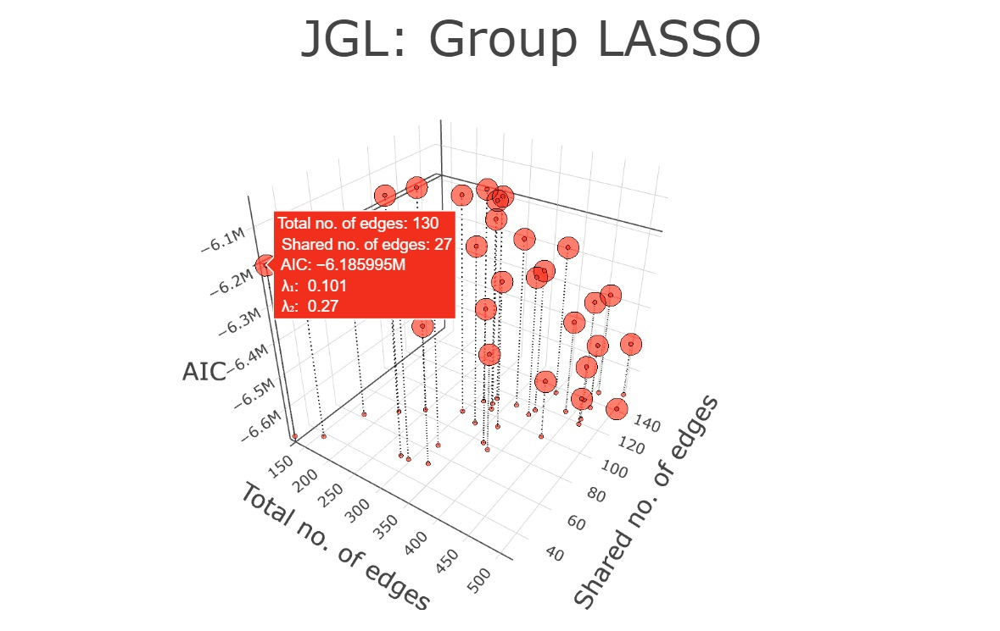
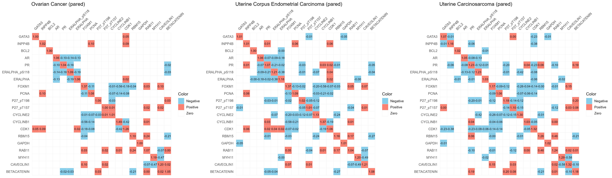

# `pared`: Model selection using multi-objective optimization
We present the R package `pared` to enable the use of multi-objective optimization for model selection. Our approach entails the use of Gaussian process-based optimization to efficiently identify solutions that represent desirable trade-offs. Our implementation includes popular models with multiple objectives including the elastic
net, fused lasso, fused graphical lasso, and group graphical lasso. Provided R package `pared` generate interactive graphics that allow the user to identify hyperparameter values that result in fitted models which lie on the Pareto frontier.


## Table of Contents
- [Installation](#installation)
- [Joint Graphical LASSO](#joint-graphical-lasso)
- [Elastic-Net](#elastic-net)
- [Fused LASSO](#fused-lasso)
- [Case-study: Fitting JGL to cancer proteomics dataset](#case-study-fitting-jgl-to-cancer-proteomics-dataset)

## Installation
R package `pared` can be directly installed from GitHub as follows.
```r
# Install packages
devtools::install_github("priyamdas2/paredBasic3", force = TRUE)
# load library
library(paredBasic3)
```
## Joint Graphical LASSO
The function `pared_JGL()` generates an interactive 3D Pareto front plot for the Joint Graphical Lasso (JGL) using GP-based optimization. It supports both group and fused penalties. Additionally, it provides the list of Pareto-optimal values of the tuning parameters λ₁ and λ₂.
```r
# See help for pared_JGL
?pared_JGL
```
### JGL with group penalty
Following example code identifies the Pareto-optimal points for Group JGL. 

```r
# Generate sample
sample_data <- generate_sample(sample_sizes = c(30, 50, 40, 70), rand_seed = 123)
# Finding optimals on Pareto-frontier for 'group' JGL
result <- pared_JGL(sample_list = sample_data, method = "group", Pareto_budget = 50)
# Extract list of optimal tuning parameters
result$summary_table
# Extract interactive figure showing optimal points on Pareto-frontier
result$figure
```
A screenshot of the generated interactive plotly plot is provided below.


### JGL with fused penalty
Following example code identifies the Pareto-optimal points for Fused JGL.

```r
sample_data2 <- generate_sample()
resultFused <- pared_JGL(sample_list = sample_data2, method = "fused", 
                         plot_marker_symbol = 'diamond', plot_marker_color = 'blue', 
                         plot_marker_size = 7, Pareto_budget = 40)

resultFused$summary_table
resultFused$figure
```
A screenshot of the generated interactive plotly plot is provided below.


## Elastic-Net

The function `pared_ENet()` performs a Pareto optimality search on the Elastic-Net problem using GP-based optimization and creates a 3D scatter plot of the solution space. The plot displays the number of non-zero coefficients, L2 norm of coefficients, and deviance for different Pareto-optimal combinations of the regularization parameters 𝛼 (0 < 𝛼 < 1) and λ.

```r
# See help for pared_ENet
?pared_ENet

set.seed(1)
p <- 5
X <- matrix(rnorm(100), ncol = p)
n <- dim(X)[1]
beta.true <- matrix(c(1,2), ncol = 1)  # only first few coordinates are non-zero
y <- X[, 1:2] %*% beta.true + rnorm(n)

A <- pared_ENet(X, y, Pareto_budget = 50)
A$summary_table
A$fig
```
A screenshot of the generated interactive plotly plot is provided below.


## Fused LASSO

The function `pared_FLasso()` performs a Pareto optimality search on the Fused Lasso problem using GP-based optimization and creates a 3D scatter plot of the solution space. The plot displays the number of non-zero coefficients, residual sum of squares (RSS), and roughness (mean absolute difference of consecutive beta coefficients) for different Pareto-optimal combinations of the regularization parameters λ₁ and λ₂.

```r
# See help for pared_FLasso
?pared_FLasso


set.seed(123)
n <- 100
p <- 10
X <- matrix(rnorm(n * p), nrow = n, ncol = p)
beta_true <- c(0, 0, 1, 1, 1, 0, 0, 0, 2, 2)
y <- X %*% beta_true + rnorm(n)


result <- pared_FLasso(X, y, Pareto_budget = 80, plot_marker_symbol = 'square', plot_marker_size = 7)
result$summary_table
result$figure
```

A screenshot of the generated interactive plotly plot is provided below.

Fitting back Fused Lasso for any given values of λ₁ (= 0.146) and λ₂ (= 0.002).
```r
# Fitting fused lasso with desired lambda_1 and lambda_2 values

log_lam1 <- log10(0.146)
log_lam2 <- log10(0.002)

g <- function(beta) FLasso_objective(X, y, beta, log_lam1, log_lam2)

beta_init <- rep(0, p)
opt_result <- optim(par = beta_init, fn = g,  method = "BFGS", control = list(maxit = 1000))
beta_opt <- opt_result$par
print(beta_opt)
```

## Case-study: Fitting JGL to cancer proteomics dataset

We consider The Cancer Genome Atlas (TCGA) proteomic data for three related cancers: Ovarian Cancer (OV), Uterine Corpus Endometrial Carcinoma (UCEC), and Uterine Carcinosarcoma (UCS), with sample sizes of 428, 404, and 48, respectively. In total, we consider 20 proteins that collectively represent the *breast reactive*, *cell cycle*, *hormone receptor*, and *hormone signaling breast* pathways. We first apply the Joint Graphical Lasso (JGL) with a group penalty, varying λ₁ and λ₂, and select the model with the lowest AIC. The estimated precision matrices for the three cancers are shown below.


Now using `pared_JGL()`, we identify the set of Pareto-optimal points and reconstruct the network corresponding to one such solution with  (λ₁, λ₂) = (0.101, 0.27). 



Corresponding to (λ₁, λ₂) = (0.101, 0.27), the estimated network obtained using JGL with a group penalty is found to be sparser than that obtained using the conventional approach of minimizing AIC. Corresponding pan-cancer proteomic networks are provided below. The reproducible code used to obtain the analysis results of this case study section is provided in the `case study` folder.



